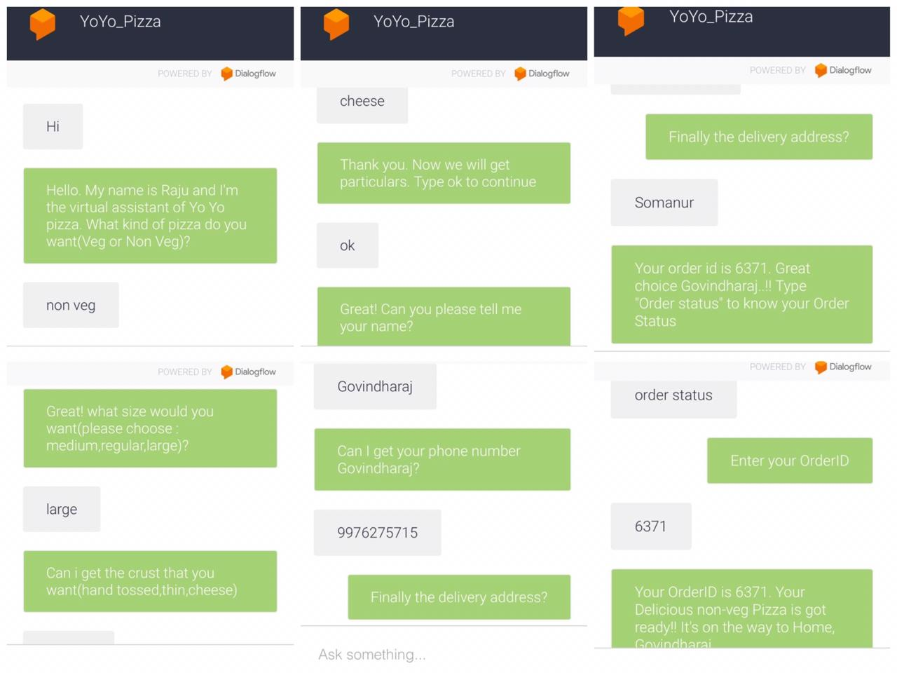
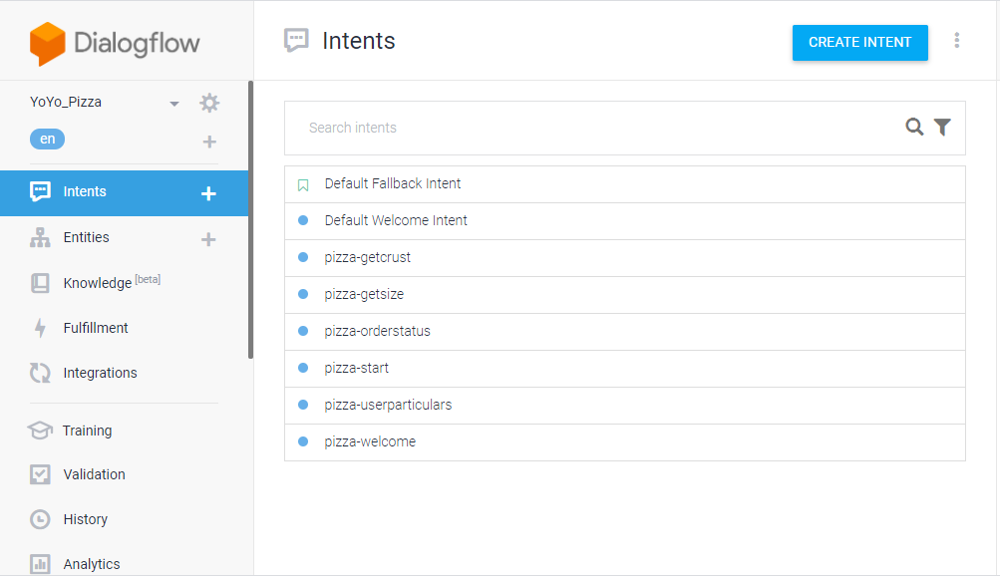
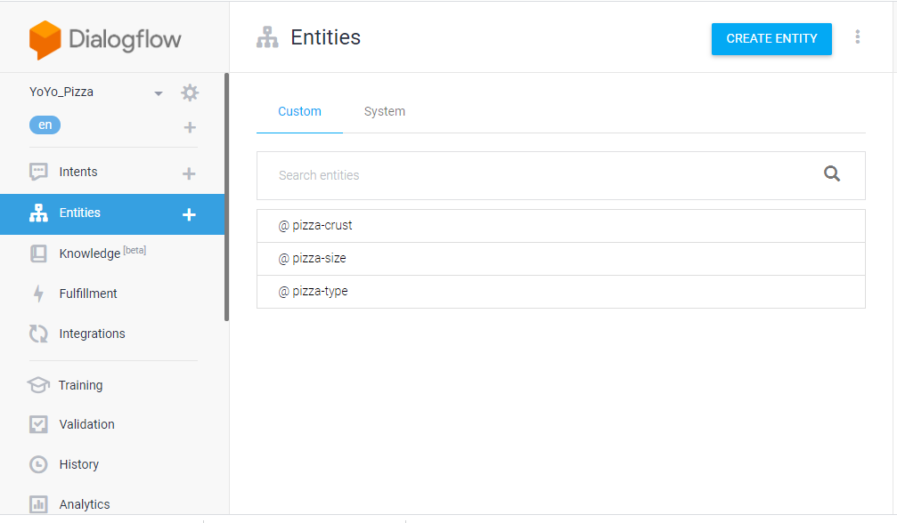
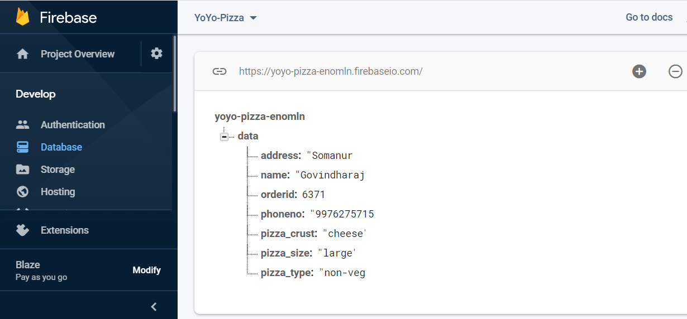
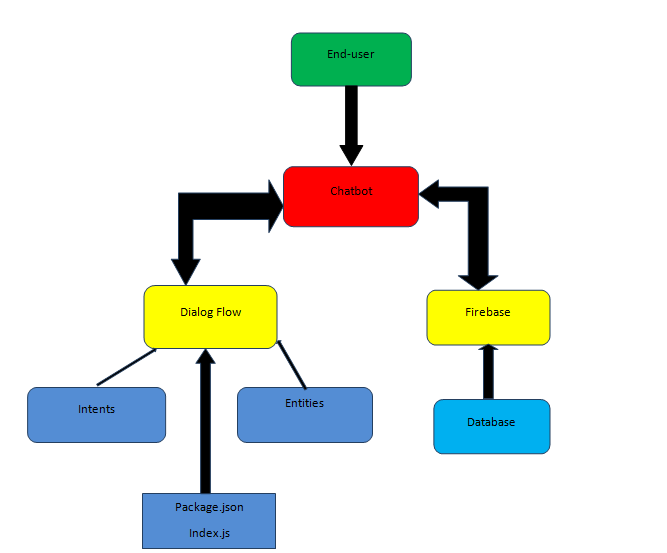

# YoYoPizza_ChatBot

## About the YoYoPizza ChatBot
Pizza Ordering ChatBot using Dialogflow and Firebase. Using YoYoPizza ChatBot we can order the pizza.

## Link for the YoYoPizza ChatBot
https://bot.dialogflow.com/95e740a8-58be-4970-803b-65efea6834ca 
https://rb.gy/qedpfw

## Steps to use YoYoPizza ChatBot 
1. Say Hi, Hello and Hey to start the chatbot 
2. Enter a type of pizza from the given options.(veg or non-veg)
3. Enter a pizza size from the given options.(medium,regular,large)
4. Add crust if you need any from the given options.(hand tossed,thin,cheese)
5. Then type ok to continue to add user delivery details
6. Enter your name, phone number and address (please enter a valid 10 digit phone number and address)
7. You can also ask the status of your pizza using your order id

## Screenshot of YoYoPizza ChatBot

## Dialogflow
The intents ,entities and main index.js code is defined in Dialogflow.

## Firebase
Firebase is the realtime database for ChatBot. All the order from chats are stored in firebase database.

## Architecture of the YoYoPizza ChatBot

